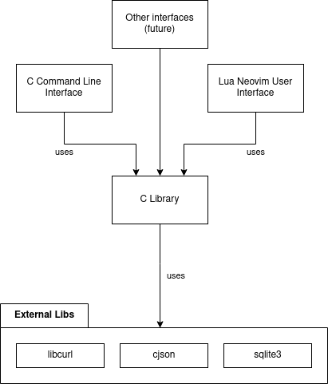

# portf

Portf is a cli tool for managing your stonks portfolio. Originally it started as a
rust project but I didn't get anywhere so here is take 2.

Disclaimer: This is still WIP, and I don't encourage or expect anyone to use it or
adopt it. Stay tone for future updates :D

## Concept and Architecture

Portf is made of the following layers and components:

- C Library: _Logic Layer_
  - processing API requests.
  - storing and retrieving data from local database.
- User Interfaces: _Presentation Layer_
  - CLI:
    - To support scripting and further integrations.
    - To integrate with status bar
    - To write notifications with dunst
    - ...
  - TUI: _utilizing neovim_
    - To present followed portfolio/stonks.
    - To add/remove stonks.
    - To create watchers.
    - ...
  - Other: _options_
    - python + matplotlib or c++ & qt to draw graphs.
    - Library that draw graphes in terminal or build custom one in
      lua, which can be reused to write to neovim buffer.,

Disclaimer: I don't think we have to do a lot of async things because we mainly
operate on the local database and the sync will happen either as cronjob or as
daemon (more about that below). I am more interested in keeping it simple and
stupid (kiss).

## Logic

- Storage: Local database with a lot of stonks.

- Background Service: Update local database on threshold e.g. every 5 minutes
  - Options
    - Cronjob `portf -Sy`
    - Daemon: self contained background service
- Search: `portf -Ss phrase`
    - Maybe we want something like yay search here, were you can pick
      For example i want 1, 4, 6
      And then you start tracking them
  - Use api request completion to go from `Apple` to `AAPL` (symbols may be
    tricky to remember)
- Tracking/Portfolio:
  - Database Tables
    - Stonk Table: _Holds all stonks you watch, whether you own shares for them or not_.
    - Portfolios Table: _Store multiple portfolios_ e.g.
        - portfolio memes holds shares to memes (Gamestop, AMC)
        - portfolio long holds shares for long term things (AAPL)
        - portfolio gamble contains all nonesense things, idk
  - API to get a overview for one or many portfolios
    +/- for day/week/month/year/since_bought
    etc
  - Watchers which will send notifications when a case happens
    - e.g. AAPL falls below \$100
    - or maybe even more difficult things (Maybe there is some news api we can
      watch and crawl)

## Limitations

- Request Rate Limitation, Multiple APIs might be a possible workaround.
- Limitation pre request: Up to 10 stonks at the same time. Sending multiple
  requests at the same time might be a possible workaround.
  (`curl_multi_add_handle`)

## TODO

- [ ] More flexible buildsystem (still plain makefiles but better)
  - [ ] `make install`
  - [ ] `make uninstall`
  - [ ] maybe split up library in multiple files at some point, rather than
        having all helpers in the same c file
- [ ] `portf -Ss`
- [ ] `portf -Sy`
- [ ] `portf -Q` query local db
- [ ] configuration system
  - [ ] Like we need to be able to configure multiple apis, so we need to be
        able to have multiple api keys
  - [ ] Region
  - [ ] Currency, not everybody live in the US.
  - [ ] (Daemon) Define market times only sync between
    - [ ] (Daemon) 9:30am - 4pm (US, NY)
    - [ ] (Daemon) 8am - 10pm (Germany)
    - And more should be possible
  - [ ] (Daemon) define refresh time
- [ ] Watchers, should also be handle in configuration file
  - [ ] How much scripting do i want to provide or just constraints
    - stonk[aapl].price < 100 (watches pre, regular and post price)
    - stonk[aapl].regular.price < 100 (watches regular)
    - port[gme].change_percent > 10 (watches changes in percent only if
      gme in a portfolio)
  - [ ] Its difficult to think about this, it would be cool to be able to
        script more advanced things here but i also don't want to embed `lua`
        into the library(core).

## Installation

1. Create an API Key for yahoo finance low latency API in `.config/portf`. note:
   this might change in the future
2. run `make`
  - Make sure you have the dependencies installed. Currently libcurl and cjson
3. `export LD_LIBRARY_PATH=$PWD/build:$LD_LIBRARY_PATH` so it finds the .so
4. `./build/portf -Sf gme amc aapl`
  - I am still designing the cli, so the call might change in the future
5. in neovim (assuming cwd = this repo)
  - `:lua require('lua/portf/init').get_share({ 'GME', 'AMC', 'AAPL' })`
  - subject to change

(currently only linux support, might change in the future)

## Inspiration

- command line interface arguments is inspired by pacman

## Bad jokes

`:%s/stonks/stocks/g`
